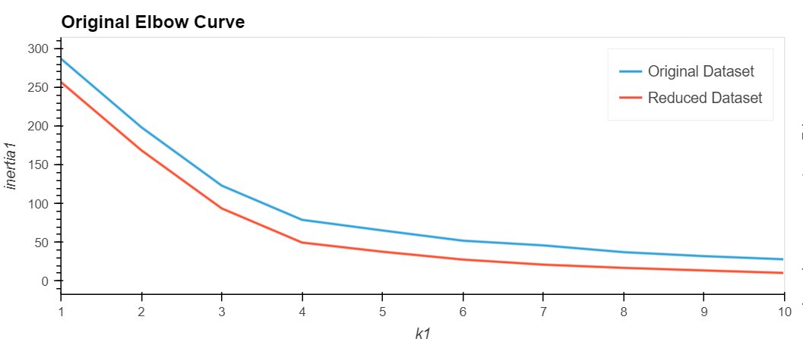
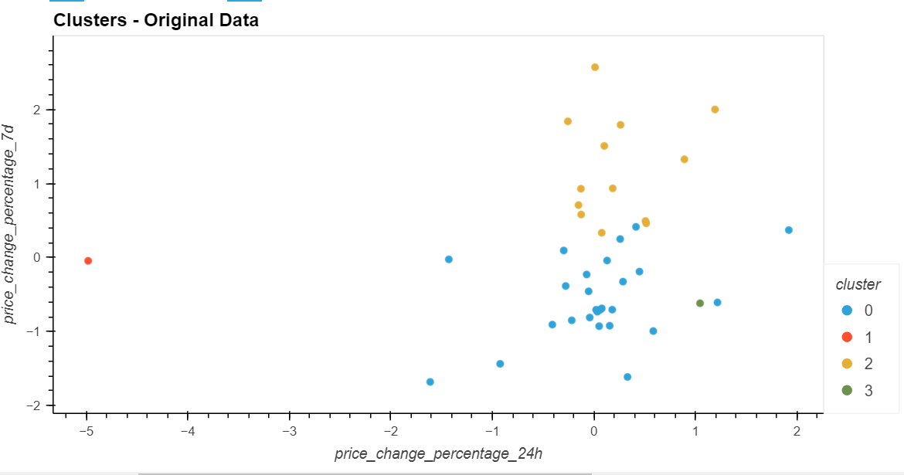
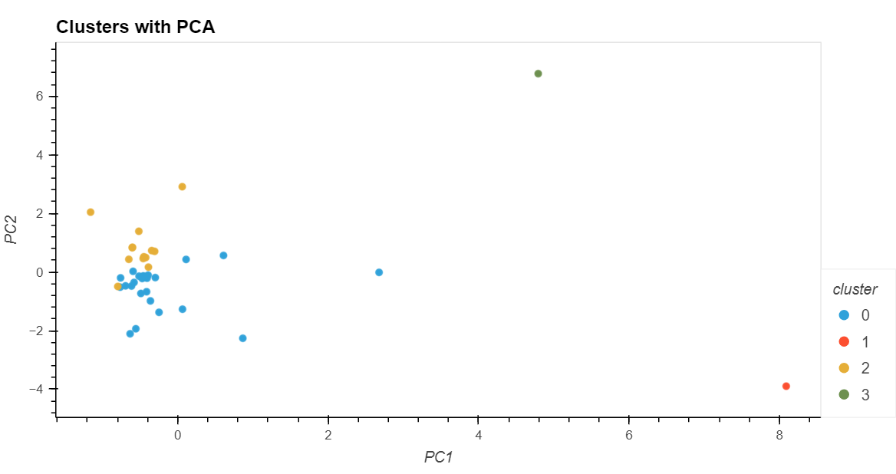

# CryptoClustering

## Table of Contents
- [About](#about)
- [Key Steps](#key-steps)
- [Analysis](#analysis)

## About
Used Python and unsupervised machine learning to categorize and group cryptocurrencies that exhibit similar historical price change patterns.

## Key Steps
1. Prepared the data. Used StandardScalar for data normalization.
2. Found the Best Value for k Using the Original Scaled DataFrame.
3. Clustered Cryptocurrencies with K-means Using the Original Scaled Data.
4. Optimized Clusters with Principal Component Analysis.
5. Found the Best Value for k Using the PCA Data
6. Cluster Cryptocurrencies with K-means Using the PCA Data

## Analysis
What is the best value for k?
The rate of decreased inertia slows after K3. 4 is the best k value in both data sets.

What is the impact of using fewer features to cluster the data using K-Means?
The following observations are made for the PCA Clusters:
- Orange and blue clusters show an increased overlap in the PCA Clusters.
- Increased overlap suggests a more spread out distribution.
- Using reduced features causes a loss of information which affects cluster accuracy and outlier positioning.

